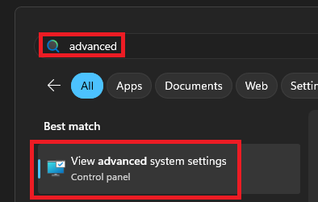
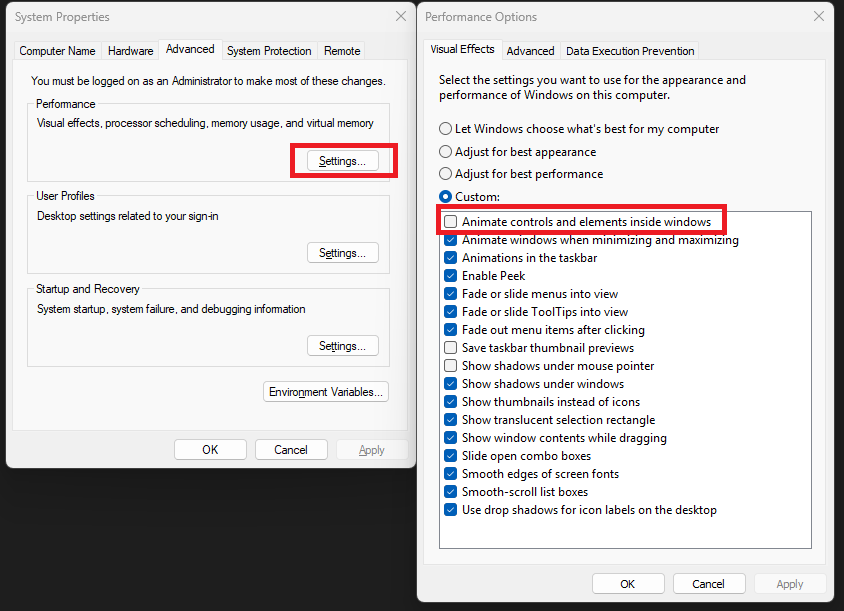
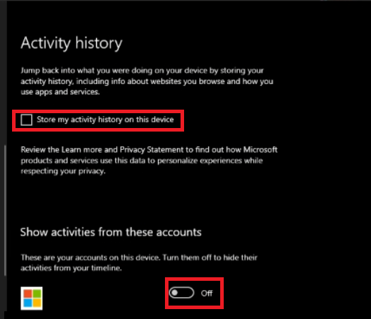
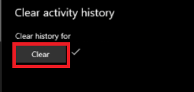

# F-WIN-ALT-TAB

Automatically converts ALT+TAB to WIN+TAB, providing a more efficient window switching experience on multi-monitor setups.

A lightweight utility that enhances the ALT+TAB experience for multi-monitor setups by showing only the windows on your active monitor.

## Features

- Intercepts ALT+TAB and converts it to WIN+TAB
- Shows only windows from the current monitor
- Minimal resource usage
- No additional UI elements
- Automatically disables the native Windows Alt+Tab menu

TODO: Create a software with a tray icon

## Prerequisites

- Python 3.6 or higher
- Required packages: `keyboard`, `pywin32`, `pystray`

## Installation

1. Clone this repository or download the files
2. Install the required packages if the automatic installer didn't work:

```bash
pip install keyboard pywin32 pystray
```

3. Double click the `run.cmd` script and keep it active

---

To run in development mode use:

```bash
python f-win-alt-tab.py
```

To uninstall the packages use:

```bash
pip uninstall keyboard pywin32 pystray
```

## Making it faster

Search for Advanced System Settings and Uncheck "Animate controls and elements inside windows" from the "Performance Options" dialog to make the `WIN+Tab` experience faster.





## Remove task view windows 10 remove history

Open `Settings->Privacy` and under `Activity history` uncheck `Store my activity history on this device` and turn off any microsoft account there





## Related Issues

Super User:

[Alt + Tab How to open only windows from active monitor](https://superuser.com/questions/1761948/alt-tab-how-to-open-only-windows-from-active-monitor)

[How to restrict Alt-Tab to cycling windows on current monitor only?](https://superuser.com/questions/1604591/how-to-restrict-alt-tab-to-cycling-windows-on-current-monitor-only)

[Make Windows 10 Alt+Tab show all windows at once instead of paginating](https://superuser.com/questions/1794305/make-windows-10-alttab-show-all-windows-at-once-instead-of-paginating)

[How to display ALT+TAB on both monitors?](https://superuser.com/questions/1079938/how-to-display-alttab-on-both-monitors)

[Make the Alt-Tab stack monitor based](https://superuser.com/questions/1134741/make-the-alt-tab-stack-monitor-based)

Reddit:

[Is there a way to make Alt-Tab only show the windows on the current monitor?](https://www.reddit.com/r/Windows10/comments/m0nci9/is_there_a_way_to_make_alttab_only_show_the/)

[Can I make the Alt+Tab window switcher only show windows of the current monitor?](https://www.reddit.com/r/kde/comments/ktykjm/can_i_make_the_alttab_window_switcher_only_show/)

[Alt+Tab only through windows on current display option](https://www.reddit.com/r/Windows11/comments/ug5hmb/alttab_only_through_windows_on_current_display/)

[Is there a way to make alt tab only show the windows in the current monitor?](https://www.reddit.com/r/pop_os/comments/hgtkvt/is_there_a_way_to_make_alt_tab_only_show_the/)

[Show only the current monitor's windows in Alt+Tab](https://www.reddit.com/r/Windows10/comments/ksv4oh/show_only_the_current_monitors_windows_in_alttab/)

Stackoverflow:

[Is it possible to detect when a window is being activated from Alt+Tab?](https://stackoverflow.com/questions/73366172/is-it-possible-to-detect-when-a-window-is-being-activated-from-alttab)

[Detect Win+Tab Task View](https://stackoverflow.com/questions/46653985/detect-wintab-task-view)

[Disable Alt+Tab Combination on Tkinter App](https://stackoverflow.com/questions/39110800/disable-alttab-combination-on-tkinter-app)

[How to disable normal behaviour of Alt key?](https://stackoverflow.com/questions/9627379/how-to-disable-normal-behaviour-of-alt-key)

[Disable Alt+Tab Tkinter - Standard Library](https://stackoverflow.com/questions/54906926/disable-alttab-tkinter-standard-library)

[Windows 10 new Task View feature access](https://stackoverflow.com/questions/31213105/windows-10-new-task-view-feature-access)

[activate task view programmatically windows 10](https://stackoverflow.com/questions/31721140/activate-task-view-programmatically-windows-10)

[VBS for opening the Windows 10 task view](https://stackoverflow.com/questions/34956274/vbs-for-opening-the-windows-10-task-view)

## How it works?

```py
import win32com.client
objShell = win32com.client.Dispatch("Shell.Application")
objShell.WindowSwitcher()
```
